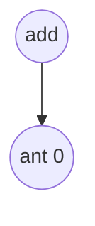
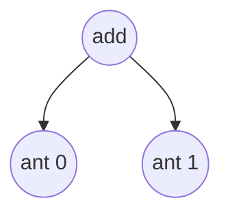
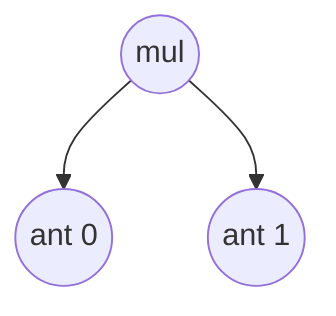
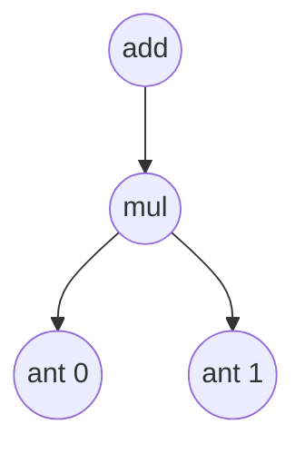
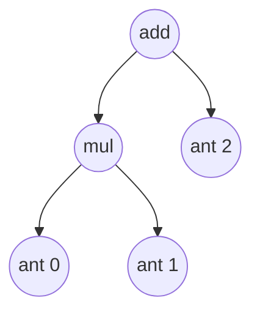

# 自制深度学习推理框架-表达式层的实现

>赞助方： datawhale
>
>作者：[傅莘莘](https://github.com/zjhellofss/KuiperInfer)、[散步](https://github.com/sanbuphy/kineto)、陈前
>
>本章的代码：https://github.com/zjhellofss/kuiperdatawhale.git
>
>补充材料: https://www.bilibili.com/video/BV1HY4y1Z7S3/


## 表达式的定义

`PNNX`中的表达式就是一个二元的计算过程，类似如下：

```
output_mid = input1 + input2;
output = output_mid * input3;
```

在`PNNX`的表达式层（Expression Layer）中，提供了一种计算表达式，该表达式能够在一定程度上折叠计算过程并消除中间变量。例如，在残差结构中的add操作在`PNNX`中就是一个表达式层。

下面是`PNNX`中对上述过程的计算表达式表示，其中的`@0`和`@1`代表之前提到的计算数`RuntimeOperand`，用于表示计算表达式中的输入节点。

```
mul(@2, add(@0, @1));
```

尽管这个抽象表达式看起来比较简单，但实际上可能存在更为复杂的情况，例如以下的例子。因此，在这种情况下，我们需要一个强大而可靠的表达式解析和语法树构建功能。

```
add(add(mul(@0, @1), mul(@2, add(add(add(@0, @2), @3), @4))), @5);
```

## 词法解析

### 词法定义

词法解析的目的是将**add(@0, mul(@1, @2))**拆分为多个Token，拆分后的Token依次为：

1. Identifier: **add**
2. Left bracket: **(**
3. Input number: **@0**
4. Comma: **,**
5. Identifier: **mul**
6. Left bracket: **(**
7. Input number: **@1**
8. Comma: **,**
9. Input number:  **@2**
10. Right bracket: **)**

`Token`的类型定义如下：

```cpp
enum class TokenType {
  TokenUnknown = -9,
  TokenInputNumber = -8,
  TokenComma = -7,
  TokenAdd = -6,
  TokenMul = -5,
  TokenLeftBracket = -4,
  TokenRightBracket = -3,
};
```

Token的定义如下，包括以下变量：

1. Token类型，包括add（加法），mul（乘法），bracket（左右括号）等；
2. Token在原句子中的开始和结束位置，即`start_pos`和`end_pos`；

对于表达式**add(@0, mul(@1, @2))**，我们可以将它切分为多个Token，其中Token(add)的`start_pos`为0，`end_pos`为3。Token(left bracket)的`start_pos`为3，`end_pos`为4。Token(@0)的`start_pos`为4，`end_pos`为5，以此类推。

```cpp
// 词语Token
struct Token {
    TokenType token_type = TokenType::TokenUnknown;
    int32_t start_pos = 0; // 词语开始的位置
    int32_t end_pos = 0;   // 词语结束的位置
    Token(TokenType token_type, int32_t start_pos, int32_t end_pos)
        : token_type(token_type), start_pos(start_pos), end_pos(end_pos) {

        }
};
```

最后，在词法解析结束后，我们需要将这些 Token（词语）按照它们的出现顺序和层级关系组成一棵语法树。

```cpp
// 语法树的节点
struct TokenNode {
    int32_t num_index = -1;
    std::shared_ptr<TokenNode> left = nullptr;   // 语法树的左节点
    std::shared_ptr<TokenNode> right = nullptr;  // 语法树的右节点
    TokenNode(int32_t num_index, std::shared_ptr<TokenNode> left,
              std::shared_ptr<TokenNode> right);
    TokenNode() = default;
};
```

### 词法解析

#### 判断句子是否为空

```cpp
CHECK(!statement_.empty()) << "The input statement is empty!";
```

#### 移除句子中的空格

```cpp
statement_.erase(std::remove_if(statement_.begin(), statement_.end(),
                                [](char c) { return std::isspace(c); }),
                 statement_.end());
CHECK(!statement_.empty()) << "The input statement is empty!";
```

如果表达式层中有表达式为`add(@0,   @1)`，我们删除其中的空格后就会得到新的表达式`add(@0,@1)`。

#### 逐个解析句子的字符

```cpp
for (int32_t i = 0; i < statement_.size();) {
    char c = statement_.at(i);
    if (c == 'a') {
        CHECK(i + 1 < statement_.size() && statement_.at(i + 1) == 'd')
            << "Parse add token failed, illegal character: "
            << statement_.at(i + 1);
        CHECK(i + 2 < statement_.size() && statement_.at(i + 2) == 'd')
            << "Parse add token failed, illegal character: "
            << statement_.at(i + 2);
        Token token(TokenType::TokenAdd, i, i + 3);
        tokens_.push_back(token);
        std::string token_operation =
            std::string(statement_.begin() + i, statement_.begin() + i + 3);
        token_strs_.push_back(token_operation);
        i = i + 3;
    } 
```

假设字符 `c` 表示当前的字符。如果 `c` 等于字符 'a'，根据我们的词法规定，Token 中以 'a' 开头的情况只有 add。因此，我们需要判断接下来的两个字符是否分别是 'd' 和 'd'。如果不是，则报错。如果是的话，则初始化一个新的 Token，并保存其在表达式中的初始和结束位置。

举个例子，如果表达式中的单词以 'a' 开头，那么它只能是 add，而不能是其他词汇表之外的单词，例如 `axc` 等情况。

```cpp
CHECK(i + 1 < statement_.size() && statement_.at(i + 1) == 'd')
    << "Parse add token failed, illegal character: "
    << statement_.at(i + 1);
CHECK(i + 2 < statement_.size() && statement_.at(i + 2) == 'd')
    << "Parse add token failed, illegal character: "
    << statement_.at(i + 2);
Token token(TokenType::TokenAdd, i, i + 3);
tokens_.push_back(token);
std::string token_operation =
    std::string(statement_.begin() + i, statement_.begin() + i + 3);
token_strs_.push_back(token_operation);
```

如果在第一行中，我们判断第二个字符是否为 'd'；若是，在第二行中，我们判断第三个字符是否也是 'd'。如果满足条件，我们将初始化一个 Token 实例，并保存该单词在句子中的起始位置和结束位置。

同样地，如果某个字符 `c` 是 'm'，我们需要判断接下来的字符是否是 'u' 和 'l'。如果不满足条件，则说明我们的表达式中出现了词汇表之外的单词（因为词汇表只允许以 'm' 开头的单词是 "mul"）。如果满足条件，我们同样会初始化一个 Token 实例，并保存该单词的起始和结束位置，以及 Token 的类型。

```cpp
else if (c == '@') {
    CHECK(i + 1 < statement_.size() && std::isdigit(statement_.at(i + 1)))
        << "Parse number token failed, illegal character: " << c;
    int32_t j = i + 1;
    for (; j < statement_.size(); ++j) {
        if (!std::isdigit(statement_.at(j))) {
            break;
        }
    }
    Token token(TokenType::TokenInputNumber, i, j);
    CHECK(token.start_pos < token.end_pos);
    tokens_.push_back(token);
    std::string token_input_number = std::string(statement_.begin() + i, statement_.begin() + j);
    token_strs_.push_back(token_input_number);
    i = j;
```

如果第一个字符是 '@'，我们需要读取 '@' 后面的所有数字，例如对于@31231，我们需要读取@符号之后的所有数字。如果紧跟在 '@' 后面的字符不是数字，则报错。如果是数字，则将这些数字全部读取并组成一个单词（Token）。

```cpp
else if (c == ',') {
      Token token(TokenType::TokenComma, i, i + 1);
      tokens_.push_back(token);
      std::string token_comma =
          std::string(statement_.begin() + i, statement_.begin() + i + 1);
      token_strs_.push_back(token_comma);
      i += 1;
}
```

如果第一个字符是','逗号，那么我们直接读取这个字符作为一个新的Token。

最后，在正确解析和创建这些 Token 后，我们将它们放入名为 `tokens` 的数组中，以便进行后续处理。

```cpp
tokens_.push_back(token);
```

## 语法解析

### 语法树的定义

```cpp
struct TokenNode {
    int32_t num_index = -1;
    std::shared_ptr<TokenNode> left = nullptr;
    std::shared_ptr<TokenNode> right = nullptr;
    TokenNode(int32_t num_index, std::shared_ptr<TokenNode> left, std::shared_ptr<TokenNode> right);
    TokenNode() = default;
};
```

在进行语法分析时，我们可以根据词法分析得到的 `token` 数组构建抽象语法树。抽象语法树是一个由二叉树组成的结构，每个节点都存储了操作符号或值，并通过左子节点和右子节点与其他节点连接。

对于表达式 "add (@0, @1)"，当 `num_index` 等于 1 时，表示计算数为 @0；当 `num_index` 等于 2 时，表示计算数为 @1。若 `num_index` 为负数，则说明当前节点是一个计算节点，如 "mul" 或 "add" 等。

以下是一个简单的示例：

```
     add
    /   \
  @0     @1
```

在这个示例中，根节点是 "add"，左子节点是 "@0"，右子节点是 "@1"。这个抽象语法树表示了一个将 "@0" 和 "@1" 进行相加的表达式。

通过将词法分析得到的 `token` 数组解析并构建抽象语法树，我们可以进一步对表达式进行语义分析和求值等操作。

### 递归向下的解析

语法解析的过程是递归向下的,定义在`Generate_`函数中。

```cpp
std::shared_ptr<TokenNode> ExpressionParser::Generate_(int32_t &index) {
    CHECK(index < this->tokens_.size());
    const auto current_token = this->tokens_.at(index);
    CHECK(current_token.token_type == TokenType::TokenInputNumber
          || current_token.token_type == TokenType::TokenAdd || current_token.token_type == TokenType::TokenMul);
```

这个函数处理的对象是词法解析的Token（单词）数组，因为`Generate_`是一个递归函数，所以`index`参数指向Token数组中的当前处理位置.

`current_token`表示当前被处理的Token，它作为**当前递归层**的第一个Token，必须是以下类型之一。

```cpp
TokenInputNumber = 0,
TokenAdd = 2,
TokenMul = 3,
```

**如果当前Token的类型是输入数字类型，那么会直接返回一个操作数Token作为叶子节点，不再进行下一层递归（如下）。**例如，在表达式add(@0, @1)中的@0和@1被归类为输入数字类型的Token，在解析到这两个Token时会直接创建并返回语法树节点`TokenNode`。

```cpp
if (current_token.token_type == TokenType::TokenInputNumber) {
    uint32_t start_pos = current_token.start_pos + 1;
    uint32_t end_pos = current_token.end_pos;
    CHECK(end_pos > start_pos);
    CHECK(end_pos <= this->statement_.length());
    const std::string &str_number =
        std::string(this->statement_.begin() + start_pos, this->statement_.begin() + end_pos);
    return std::make_shared<TokenNode>(std::stoi(str_number), nullptr, nullptr);

}
```

**如果当前Token的类型是mul或者add，我们需要进行下一层递归来构建对应的左子节点和右子节点。**

例如，在处理add(@1,@2)时，遇到add token之后，如下的第一行代码，我们需要做以下的两步：

1. 首先判断是否存在左括号（left bracket）
2. 然后继续向下递归以获取@1，如下的第14行到17行代码，但由于@1代表的是数字类型，递归后立即返回，如以上代码块中第一行对数字类型Token的处理。

```cpp
else if (current_token.token_type == TokenType::TokenMul || current_token.token_type == TokenType::TokenAdd) {
    std::shared_ptr<TokenNode> current_node = std::make_shared<TokenNode>();
    current_node->num_index = -int(current_token.token_type);

    index += 1;
    CHECK(index < this->tokens_.size());
    // 判断add之后是否有( left bracket
    CHECK(this->tokens_.at(index).token_type == TokenType::TokenLeftBracket);

    index += 1;
    CHECK(index < this->tokens_.size());
    const auto left_token = this->tokens_.at(index);
    // 判断当前需要处理的left token是不是合法类型
    if (left_token.token_type == TokenType::TokenInputNumber
        || left_token.token_type == TokenType::TokenAdd || left_token.token_type == TokenType::TokenMul) {
        // (之后进行向下递归得到@0
        current_node->left = Generate_(index);
    } else {
        LOG(FATAL) << "Unknown token type: " << int(left_token.token_type);
    }
}
```

在第17行当左子树递归构建完毕后，将它赋值到add节点的左子树上。对于表达式`add(@0, @1)`，我们将左子树连接到`current_node`的`left`指针中，随后我们开始构建右子树。



```cpp
	index += 1; 
    // 当前的index指向add(@1,@2)中的逗号
    CHECK(index < this->tokens_.size());
    // 判断是否是逗号
    CHECK(this->tokens_.at(index).token_type == TokenType::TokenComma);

    index += 1;
    CHECK(index < this->tokens_.size());
    // current_node->right = Generate_(index);构建右子树
    const auto right_token = this->tokens_.at(index);
    if (right_token.token_type == TokenType::TokenInputNumber
        || right_token.token_type == TokenType::TokenAdd || right_token.token_type == TokenType::TokenMul) {
      current_node->right = Generate_(index);
    } else {
      LOG(FATAL) << "Unknown token type: " << int(left_token.token_type);
    }

    index += 1;
    CHECK(index < this->tokens_.size());
    CHECK(this->tokens_.at(index).token_type == TokenType::TokenRightBracket);
    return current_node;
```

随后我们需要判断@0之后是否存在comma token，如上代码中的第五行。在构建右子树的过程中，对于表达式`add(@1,@2)`，当`index`指向逗号的位置时，首先需要判断是否存在逗号。接下来，我们开始构建右子树，在右子树的向下递归分析中，会得到`@2`作为一个叶子节点。

当右子树构建完成后，将该节点（即`Generate_`返回的`TokenNode`，此处为一个叶子节点，其数据为`@1`）放置于`current_node`的`right`指针中。




### 一个例子

我们以一个简单点的例子为开始，假设现在表达式层中的表达式是：`add(@0,@1)`。在词法解析模块中，这个表达式将被构建成一个单词(Token)数组，如以下：

- add
- (
- @0
- ,
- @1
- )

在词法解析结束之后，这个表达式将被传递到语法解析模块中，用于构建抽象语法树。`Generate_`函数首先检查Token数组中的当前单词(Token)是否是以下类型的一种：

```cpp
CHECK(index < this->tokens_.size());
const auto current_token = this->tokens_.at(index);
CHECK(current_token.token_type == TokenType::TokenInputNumber ||
      current_token.token_type == TokenType::TokenAdd ||
      current_token.token_type == TokenType::TokenMul);
```

当前的索引为0，表示正在处理Token数组中的"add"单词。**针对这个输入，我们需要判断其后是否是"左括号"来确定其合法性。**如果是合法的**（add单词之后总存在括号）**，我们将构建一个左子树。因为对于一个add调用，它的后面总是跟着一个左括号"("，如下方代码的第8行。

```cpp
else if (current_token.token_type == TokenType::TokenMul ||
         current_token.token_type == TokenType::TokenAdd) {
    std::shared_ptr<TokenNode> current_node = std::make_shared<TokenNode>();
    current_node->num_index = int(current_token.token_type);

    index += 1;
    CHECK(index < this->tokens_.size()) << "Missing left bracket!";
    CHECK(this->tokens_.at(index).token_type == TokenType::TokenLeftBracket);

    index += 1;
    CHECK(index < this->tokens_.size()) << "Missing correspond left token!";
    const auto left_token = this->tokens_.at(index);
```

在以上代码的第8行中，我们对'add'之后的一个Token进行判断，如果是左括号则匹配成功，开始匹配括号内的元素。对于输入`add(@0, @1)`，在第10行中，当对索引进行+1操作后，我们需要开始解析括号内左侧的元素`left_token`.

随后我们开始递归构建表达式的左子树：

```cpp
if (left_token.token_type == TokenType::TokenInputNumber ||
    left_token.token_type == TokenType::TokenAdd ||
    left_token.token_type == TokenType::TokenMul) {
    current_node->left = Generate_(index);
} 
```

对于当前的例子，当前索引(index)指向的单词是@0。在这种情况下，由于索引指向的位置是一个输入数字@0(`TokenType::TokenInputNumber`)的类型，所以该节点进入递归调用后将直接返回。

根据前文给出的例子，'add'的左子树构建完毕后，**下一步我们需要判断中add(@0,@1)的@0之后是否存在逗号，下方代码的第二行**


```cpp
index += 1;
CHECK(index < this->tokens_.size()) << "Missing comma!";
CHECK(this->tokens_.at(index).token_type == TokenType::TokenComma);
```

接下来，我们要为如上的二叉树构建右子树：

```cpp
const auto right_token = this->tokens_.at(index);
if (right_token.token_type == TokenType::TokenInputNumber ||
    right_token.token_type == TokenType::TokenAdd ||
    right_token.token_type == TokenType::TokenMul) {
    current_node->right = Generate_(index);
} else {
    LOG(FATAL) << "Unknown token type: " << int(right_token.token_type);
}
```

同样，由于当前索引(index)指向的位置是@1，它是一个输入数据类型，所以该节点在进入递归调用后将直接返回，并成为add节点的右子树，如下方代码所示。


```cpp
std::shared_ptr<TokenNode> ExpressionParser::Generate_(int32_t &index) {
    CHECK(index < this->tokens_.size());
    ...
    ...
    如果是Input Number就直接返回

    if (current_token.token_type == TokenType::TokenInputNumber) {
        uint32_t start_pos = current_token.start_pos + 1;
        uint32_t end_pos = current_token.end_pos;
        CHECK(end_pos > start_pos);
        CHECK(end_pos <= this->statement_.length());
        const std::string &str_number =
            std::string(this->statement_.begin() + start_pos, this->statement_.begin() + end_pos);
        return std::make_shared<TokenNode>(std::stoi(str_number), nullptr, nullptr);

    }
}
```

### 一个更复杂些的例子

如果现在有一个表达式`add(mul(@0,@1),@2)`，那么我们应该如何对其进行语法解析呢？在词法解析中，它将被分割成以下的数个单词组成的数组：

1. add
2. left bracket
3. mul 
4. left bracket
5. @0 
6. comma
7. @1
8. right bracket
9. comma
10. @2
11. right bracket

当以上的数组被输入到语法解析中后，index的值等于0. 随后我们再判断index指向位置的单词类型是否符合要求。

```cpp
CHECK(current_token.token_type == TokenType::TokenInputNumber ||
      current_token.token_type == TokenType::TokenAdd ||
      current_token.token_type == TokenType::TokenMul);
```

如果该表达式的第一个单词是"add"，那么我们就像之前的例子一样，将它作为二叉树的左子树进行构建。

```cpp
if (left_token.token_type == TokenType::TokenInputNumber ||
    left_token.token_type == TokenType::TokenAdd ||
    left_token.token_type == TokenType::TokenMul) {
    current_node->left = Generate_(index);
```

已知表达式为`add(mul(@0,@1),@2)`，在处理完这个表达式的左括号之后，**当前指向的标记是"mul"，它不属于输入参数类型。因此，在调用`Generate_`函数时，我们将对"mul"子表达式进行递归分析。**

对"mul"子表达式解析的方式和对`add(@0,@1)`解析的方式相同，"mul"子表达式的分析结果如下图所示：



在子表达式的解析完成并返回后，我们将这颗子树插入到当前节点的左指针上**(current_node->left = Generate_(index))**




**随后我们开始解析`add(mul(@0,@1),@2)`表达式中@2以及其之后的部分作为add的右子树。**

```cpp
if (right_token.token_type == TokenType::TokenInputNumber ||
    right_token.token_type == TokenType::TokenAdd ||
    right_token.token_type == TokenType::TokenMul) {
    current_node->right = Generate_(index);
} else {
    LOG(FATAL) << "Unknown token type: " << int(right_token.token_type);
}
```

在第4行调用`Generate_`之后，由于@2是一个输入数类型，不再进行递归分析，所以它将被直接返回并赋值给`current_node->right`。



```cpp
std::shared_ptr<TokenNode> ExpressionParser::Generate_(int32_t &index) {
    CHECK(index < this->tokens_.size());
    ...
    ...
    如果是Input Number就直接返回

    if (current_token.token_type == TokenType::TokenInputNumber) {
        uint32_t start_pos = current_token.start_pos + 1;
        uint32_t end_pos = current_token.end_pos;
        CHECK(end_pos > start_pos);
        CHECK(end_pos <= this->statement_.length());
        const std::string &str_number =
            std::string(this->statement_.begin() + start_pos, this->statement_.begin() + end_pos);
        return std::make_shared<TokenNode>(std::stoi(str_number), nullptr, nullptr);

    }
}
```

最终，我们成功完成了这个较为复杂的二叉树构建例子。

## 单元测试1

### 词法解析

```cpp
TEST(test_parser, tokenizer) {
  using namespace kuiper_infer;
  const std::string &str = "";
  ExpressionParser parser(str);
  parser.Tokenizer();
  const auto &tokens = parser.tokens();
  ASSERT_EQ(tokens.empty(), false);

  const auto &token_strs = parser.token_strs();
  ASSERT_EQ(token_strs.at(0), "add");
  ASSERT_EQ(tokens.at(0).token_type, TokenType::TokenAdd);

  ASSERT_EQ(token_strs.at(1), "(");
  ASSERT_EQ(tokens.at(1).token_type, TokenType::TokenLeftBracket);

  ASSERT_EQ(token_strs.at(2), "@0");
  ASSERT_EQ(tokens.at(2).token_type, TokenType::TokenInputNumber);

  ASSERT_EQ(token_strs.at(3), ",");
  ASSERT_EQ(tokens.at(3).token_type, TokenType::TokenComma);

  ASSERT_EQ(token_strs.at(4), "mul");
  ASSERT_EQ(tokens.at(4).token_type, TokenType::TokenMul);

  ASSERT_EQ(token_strs.at(5), "(");
  ASSERT_EQ(tokens.at(5).token_type, TokenType::TokenLeftBracket);

  ASSERT_EQ(token_strs.at(6), "@1");
  ASSERT_EQ(tokens.at(6).token_type, TokenType::TokenInputNumber);

  ASSERT_EQ(token_strs.at(7), ",");
  ASSERT_EQ(tokens.at(7).token_type, TokenType::TokenComma);

  ASSERT_EQ(token_strs.at(8), "@2");
  ASSERT_EQ(tokens.at(8).token_type, TokenType::TokenInputNumber);

  ASSERT_EQ(token_strs.at(9), ")");
  ASSERT_EQ(tokens.at(9).token_type, TokenType::TokenRightBracket);

  ASSERT_EQ(token_strs.at(10), ")");
  ASSERT_EQ(tokens.at(10).token_type, TokenType::TokenRightBracket);
}
```

我们对表达式`add(@0,mul(@1,@2))`进行了词法切分，并得到了一个Tokens数组。通过逐一比对该数组，我们确认了词法分析器在这个案例下的正常工作。如果你在以上的表达式中加入了错误的符号或者单词，例如`add(@0,mcl(@1,@2))`，以上的单元测试一定会报错。

### 语法解析

```cpp
TEST(test_parser, generate1) {
  using namespace kuiper_infer;
  const std::string &str = "add(@0,@1)";
  ExpressionParser parser(str);
  parser.Tokenizer();
  int index = 0; // 从0位置开始构建语法树
  // 抽象语法树:
  //
  //    add
  //    /  \
  //  @0    @1

  const auto &node = parser.Generate_(index);
  ASSERT_EQ(node->num_index, int(TokenType::TokenAdd));
  ASSERT_EQ(node->left->num_index, 0);
  ASSERT_EQ(node->right->num_index, 1);
}
```


```cpp
TEST(test_parser, generate2) {
  using namespace kuiper_infer;
  const std::string &str = "add(mul(@0,@1),@2)";
  ExpressionParser parser(str);
  parser.Tokenizer();
  int index = 0; // 从0位置开始构建语法树
  // 抽象语法树:
  //
  //       add
  //       /  \
  //     mul   @2
  //    /   \
  //  @0    @1

  const auto &node = parser.Generate_(index);
  ASSERT_EQ(node->num_index, int(TokenType::TokenAdd));
  ASSERT_EQ(node->left->num_index, int(TokenType::TokenMul));
  ASSERT_EQ(node->left->left->num_index, 0);
  ASSERT_EQ(node->left->right->num_index, 1);

  ASSERT_EQ(node->right->num_index, 2);
}
```

在以上的代码中，我们的`Generate_`函数构造了一棵层次结构正确的语法树，同学们也可以自行尝试构建更复杂的语法树。

## 对语法树的转换

### 逆波兰式

我们来以一个简单的例子来说明，对于计算式`add(@0,@1)`，首先遇到的节点是`add`，但在遇到`add`时缺少进行计算所需的具体数据`@0`和`@1`。

**因此，我们需要进行逆波兰转换，将操作数放在前面，计算放在后面。**该转换的实现非常简单，**只需对原有的二叉树进行后续遍历即可：**

```cpp
void ReversePolish(const std::shared_ptr<TokenNode> &root_node,
                   std::vector<std::shared_ptr<TokenNode>> &reverse_polish) {
    if (root_node != nullptr) {
        ReversePolish(root_node->left, reverse_polish);
        ReversePolish(root_node->right, reverse_polish);
        reverse_polish.push_back(root_node);
    }
}
```

逆波兰式化后的表达如下：

对于 `add (@0,@1)`，逆波兰式为：`@0,@1,add`

对于 `add(mul(@0,@1),@2)`，逆波兰式为：`@0,@1,mul,@2,add`

**通过逆波兰转换，可以将原式转换为计算式的输入数放在前面，操作符号放在后面的形式。**逆波兰式的特点是消除了括号的需求，使得计算顺序更加清晰和直观。

## 整体过程回顾

经过这样的转换，可以确保在每次遇到计算节点时所需的操作数已经准备就绪。

1. 首先，传入一个表达式字符串，例如add(mul(@0,@1),@2)

2. 接下来，对add(mul(@0,@1),@2)进行词法分析，将其拆分为多个tokens，在拆分过程中需要进行词法校验。
3. 然后，根据已知的tokens数组，通过递归向下遍历进行语法分析，从而得到相应的计算二叉树。计算二叉树的各个节点可以是add、mul或者@0、@1等。
4. 最后，对计算二叉树进行逆波兰变换，得到的逆波兰式如下：@0、@1、mul、@2、add。


## 单元测试2

在这个单元测试中，我们需要将抽象语法树通过后续遍历转换为可执行的队列。在可执行队列中，各个元素满足操作数在前、操作符号在后的特点。对于如下的一个表达式：`add(mul(@0,@1),@2)`，在构建完成后，我们得到了以下形式的二叉树。该二叉树对应的逆波兰式表达式为：@0,@1,mul,@2,add.

```
  
            add
           /  \
         mul   @2
        /   \
      @0    @1
```

```cpp
TEST(test_parser, reverse_polish) {
  using namespace kuiper_infer;
  const std::string &str = "add(mul(@0,@1),@2)";
  ExpressionParser parser(str);
  parser.Tokenizer();
  // 抽象语法树:
  //
  //       add
  //       /  \
  //     mul   @2
  //    /   \
  //  @0    @1

  const auto &vec = parser.Generate();
  for (const auto &item : vec) {
    if (item->num_index == -5) {
      LOG(INFO) << "Mul";
    } else if (item->num_index == -6) {
      LOG(INFO) << "Add";
    } else {
      LOG(INFO) << item->num_index;
    }
  }
}
```

输出结果：

```txt
I20230805 12:51:25.513495  4751 test_expression.cpp:116] 0
I20230805 12:51:25.513556  4751 test_expression.cpp:116] 1
I20230805 12:51:25.513599  4751 test_expression.cpp:112] Mul
I20230805 12:51:25.513639  4751 test_expression.cpp:116] 2
I20230805 12:51:25.513679  4751 test_expression.cpp:114] Add
```

## 表达式层的实现

```cpp
class ExpressionLayer : public NonParamLayer {
 public:
  explicit ExpressionLayer( std::string statement);

  InferStatus Forward(
      const std::vector<std::shared_ptr<Tensor<float>>>& inputs,
      std::vector<std::shared_ptr<Tensor<float>>>& outputs) override;

  static ParseParameterAttrStatus GetInstance(
      const std::shared_ptr<RuntimeOperator>& op,
      std::shared_ptr<Layer>& expression_layer);

 private:
  std::string statement_;
  std::unique_ptr<ExpressionParser> parser_;
};
```

我们可以看到在表达式层面有两个类内变量。第一个是需要解析的表达式 `statement_`，第二个是之前提到的用于词法分析和语法分析的 `ExpressionParser`，需要解析的表达式`statement_`会被传入到解析器`parser_`中。

### ExpressionParser的定义

我们再来看一下`ExpressionParser`的定义：

```cpp
class ExpressionParser {
 public:
  explicit ExpressionParser(std::string statement)
      : statement_(std::move(statement)) {}
  /**
   * 词法分析
   * @param retokenize 是否需要重新进行语法分析
   */
  void Tokenizer(bool retokenize = false);

  ...
  ...

 private:
  std::shared_ptr<TokenNode> Generate_(int32_t& index);
  // 被分割的词语数组
  std::vector<Token> tokens_;
  // 被分割的字符串数组
  std::vector<std::string> token_strs_;
  // 待分割的表达式
  std::string statement_;
};
```

在`ExpressionParser`中，就像我们上文中所说的一样，`Tokenizer`用于将表达式分割为多个单词，例如将`add(@0,@1)`分割为以下的几个单词：

1. add 
2. left bracket
3. input number(@0)
4. comma

...

### ExpressionParser生成语法树

```cpp
std::vector<std::shared_ptr<TokenNode>> ExpressionParser::Generate() {
  if (this->tokens_.empty()) {
    this->Tokenizer(true);
  }
  int index = 0;
  // 构建语法树
  std::shared_ptr<TokenNode> root = Generate_(index);
  CHECK(root != nullptr);
  CHECK(index == tokens_.size() - 1);

  // 转逆波兰式,之后转移到expression中
  std::vector<std::shared_ptr<TokenNode>> reverse_polish;
  ReversePolish(root, reverse_polish);

  return reverse_polish;
}
```

在以上的代码中，我们首先调用 `Generate_` 方法。该方法通过对 `tokens` 数组进行语法分析，生成一棵抽象语法树。然后，我们对这棵抽象语法树进行逆波兰排序，得到最终的执行序列。

这些内容我们已经在前文中详细地讲述过了，这里不再详细展开。

### 表达式层的注册

我们已经在前面的几章内容中介绍了层或算子的注册过程。在定义完表达式层的计算过程后，我们需要将其注册到推理框架中。这样，框架就能够使用我们定义的表达式层进行计算。

```cpp
LayerRegistererWrapper kExpressionGetInstance("pnnx.Expression",
                                              ExpressionLayer::GetInstance);
```

我们再来看一下它的初始化过程：

```cpp
ParseParameterAttrStatus ExpressionLayer::GetInstance(
    const std::shared_ptr<RuntimeOperator>& op,
    std::shared_ptr<Layer>& expression_layer) {
  CHECK(op != nullptr) << "Expression operator is nullptr";
  const auto& params = op->params;
  if (params.find("expr") == params.end()) {
    return ParseParameterAttrStatus::kParameterMissingExpr;
  }

  auto statement_param =
      std::dynamic_pointer_cast<RuntimeParameterString>(params.at("expr"));
  if (statement_param == nullptr) {
    LOG(ERROR) << "Can not find the expression parameter";
    return ParseParameterAttrStatus::kParameterMissingExpr;
  }
  if (statement_param->type != RuntimeParameterType::kParameterString) {
    LOG(ERROR) << "Can not find the expression parameter";
    return ParseParameterAttrStatus::kParameterMissingExpr;
  }

  expression_layer = std::make_shared<ExpressionLayer>(statement_param->value);
  return ParseParameterAttrStatus::kParameterAttrParseSuccess;
}
```

先来看一个实例：


在以上的代码中：

```cpp
  auto statement_param =
      std::dynamic_pointer_cast<RuntimeParameterString>(params.at("expr"));
```

从`PNNX`中提取表达式字符串`expr`，然后使用该字符串来实例化算子。

```cpp
expression_layer = std::make_shared<ExpressionLayer>(statement_param->value);
```

### 表达式层的输入处理

在Expression Layer的Forward函数输入中，也就是在这个数组中，多个输入依次排布：

```cpp
const std::vector<std::shared_ptr<Tensor<float>>>& inputs
```

如果`batch_size`的大小为4，那么`input1`中的元素数量为4，`input2`的元素数量也为4。换句话说，`input1`中的数据都来源于同一批次的操作数1（operand 1），`input2`中的数据都来源于同一批次的操作数2（operand 2）。

其中，`input1`中的4(batch size = 4)个元素都是来自于操作数1，而`input2`中的4(batch size = 4)个元素都是来自于操作数2，它们在`inputs`数组参数中依次排列，如下图所示。


#### 对于两个输入操作数

已知有如上的数据存储排布, 在本小节中我们将讨论如何根据现有的数据完成`add(@0,@1)`计算. 可以看到每一次计算的时候, 都以此从`input1`和`input2`中取得一个数据进行加法操作, 并存放在对应的输出位置.


#### 对于三个输入操作数

下图的例子展示了对于三个输入,`mul(add(@0,@1),@2)`的情况:


每次计算的时候依次从`input1`, `input2`和`input3`中取出数据, 并作出相应的运算, 并将结果数据存放于对应的`output`中。我们简单说明一下：

1. $output_1=(input_1+input_5)\times input_9$，对于第一个输出数据，我们先从取出第一组输入（@0）中第一个输入数据$input_1$，再从第二组输入（@1）中取得第一个输入数据$input_5$，最后再从第三组输入（@2）中取得第一个输入数据$input_9$.
2. $output_2=(input_2+input_6)\times input_{10}$，对于第一个输出数据，我们先从取出第一组输入（@0）中第一个输入数据$input_2$，再从第二组输入（@1）中取得第一个输入数据$input_6$，最后再从第三组输入（@2）中取得第一个输入数据$input_{10}$.
3. $output_3=(input_3+input_7)\times input_{11}$，对于第一个输出数据，我们先从取出第一组输入（@0）中第一个输入数据$input_3$，再从第二组输入（@1）中取得第一个输入数据$input_7$，最后再从第三组输入（@2）中取得第一个输入数据$input_{11}$.
4. $output_4$同理。

### 表达式层的计算过程

表达式层同样继承于算子的父类`Layer`，并重写了其中的Forward方法。在Forward方法中，我们定义了表达式层的计算逻辑。假设现在有一个计算式为`add(mul(@0,@1),@2)`，通过抽象语法树构建和逆波兰转换，我们已经得到了以下序列：

@0、@1、mul、@2、add

在Forward函数中，我们定义了一个栈式计算模块，并维护了一个输入数栈。输入数栈是一个先进后出的数据结构，用于存放表达式中的输入数。

对于给定的表达式，例如`add(mul(@0,@1),@2)`，我们将前两个输入数依次压入输入数栈中。


在序列中的下一个节点是`mul`，它的作用是将两个输入数相乘。因此，我们需要从输入数栈中顺序地弹出两个输入数进行相乘操作。通过该操作，我们得到一个中间结果`@tmp1`。接下来，我们需要将这个中间结果存放到输入数栈中，以便供后续步骤处理。


在序列中的下一个节点是@2，因为是一个输入操作数，我们将它存放到输入数栈中，图示如下：


在序列中的最后一个节点是`add`，它是一个加法节点，需要两个输入数据。因此，它会将栈中的`@2`和`@tmp1`全部弹出，进行加法操作，得到整个计算序列最后的结果。

**我们再细讲一下:**

```cpp
if (token_node->num_index >= 0) {
    // process operator
    uint32_t start_pos = token_node->num_index * batch_size;
    std::vector<std::shared_ptr<Tensor<float>>> input_token_nodes;
    for (uint32_t i = 0; i < batch_size; ++i) {
        CHECK(i + start_pos < inputs.size())
            << "The " << i
            << "th operand doesn't have appropriate number of tensors";
        input_token_nodes.push_back(inputs.at(i + start_pos));
    }
    op_stack.push(input_token_nodes);
} 
```

根据输入的逆波兰式`@0,@1,add`，遇到的第一个节点是操作数是`@0`，所以栈`op_stack`内的内存布局如下：


当按顺序遇到第二个节点（`op`）时，也就是操作数`@1`时，我们将从`inputs`中读取操作数并将其存放到`input_token_nodes`中。然后，将`input_token_nodes`这一批次的数据放入栈中。


#### 运算符的代码处理

```cpp
const int32_t op = token_node->num_index;
...
std::vector<std::shared_ptr<Tensor<float>>> input_node1 = op_stack.top();
...
...
op_stack.pop();

std::vector<std::shared_ptr<Tensor<float>>> input_node2 = op_stack.top();
CHECK(input_node2.size() == batch_size)
    << "The second operand doesn't have appropriate number of tensors, "
    "which need "
    << batch_size;
op_stack.pop();
```

当节点（`op`）类型为操作符号时（也就是`num_index`小于0的时候），首先我们从栈（`op_stack`）中弹出两个批次的操作数。对于给定情况，`input_node1`存放的是`input1`至`input4`，而`input_node2`存放的是`input5`至`input8`。

```cpp
std::vector<std::shared_ptr<Tensor<float>>> output_token_nodes(
    batch_size);

for (uint32_t i = 0; i < batch_size; ++i) {
    // do execution
    if (op == int(TokenType::TokenAdd)) {
        output_token_nodes.at(i) =
            TensorElementAdd(input_node1.at(i), input_node2.at(i));
    } else if (op == int(TokenType::TokenMul)) {
        output_token_nodes.at(i) =
            TensorElementMultiply(input_node1.at(i), input_node2.at(i));
    } else {
        LOG(FATAL) << "Unknown operator type: " << op;
    }
}
op_stack.push(output_token_nodes);
```

在获取大小为`batch_size`的`input_node1`和`input_node2`后，流程将在`for(int i = 0...batch_size)`循环中对这两个输入进行两两操作（`input1`+`input5`, `input2`+`input6`），具体的操作类型定义于当前的`op`中。最后，我们将计算得到的结果放入输入数栈`op_stack`中。

## 单元测试3

```cpp
TEST(test_expression, complex1) {
  using namespace kuiper_infer;
  const std::string& str = "mul(@2,add(@0,@1))";
  ExpressionLayer layer(str);
  std::shared_ptr<Tensor<float>> input1 =
      std::make_shared<Tensor<float>>(3, 224, 224);
  input1->Fill(2.f);
  std::shared_ptr<Tensor<float>> input2 =
      std::make_shared<Tensor<float>>(3, 224, 224);
  input2->Fill(3.f);

  std::shared_ptr<Tensor<float>> input3 =
      std::make_shared<Tensor<float>>(3, 224, 224);
  input3->Fill(4.f);

  std::vector<std::shared_ptr<Tensor<float>>> inputs;
  inputs.push_back(input1);
  inputs.push_back(input2);
  inputs.push_back(input3);

  std::vector<std::shared_ptr<Tensor<float>>> outputs(1);
  outputs.at(0) = std::make_shared<Tensor<float>>(3, 224, 224);
  const auto status = layer.Forward(inputs, outputs);
  ASSERT_EQ(status, InferStatus::kInferSuccess);
  ASSERT_EQ(outputs.size(), 1);
  std::shared_ptr<Tensor<float>> output2 =
      std::make_shared<Tensor<float>>(3, 224, 224);
  output2->Fill(20.f);
  std::shared_ptr<Tensor<float>> output1 = outputs.front();

  ASSERT_TRUE(
      arma::approx_equal(output1->data(), output2->data(), "absdiff", 1e-5));
}
```

以上的表达式为`mul(@2,add(@0,@1))`。我们将表示`@0`的input1赋值为2，将表示`@1`的input2赋值为3，并将表示`@3`的input3赋值为4，计算结果应该是(@0 + @1 ) * @2= (2 + 3) * 4 = 20.

## 本节课的作业

> 本次作业见代码test/test_expr_homework.cpp中的单元测试

1. 词法和语法解析中支持sin(三角函数)操作

   * 词法分析：**TEST**(test_parser, tokenizer_sin)
   * 语法分析：**TEST**(test_parser, generate_sin) 

2. 如果操作符是单输入数，例如问题1中的sin函数，我们的`Forward`函数应该做出什么改动能获得正确的计算结果。

   * 完成**TEST**(test_expression, complex2)

   

