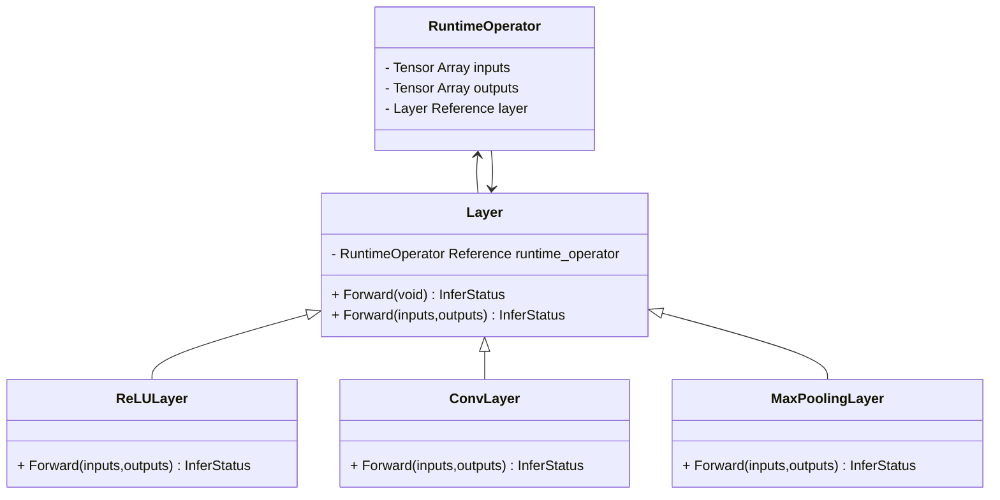
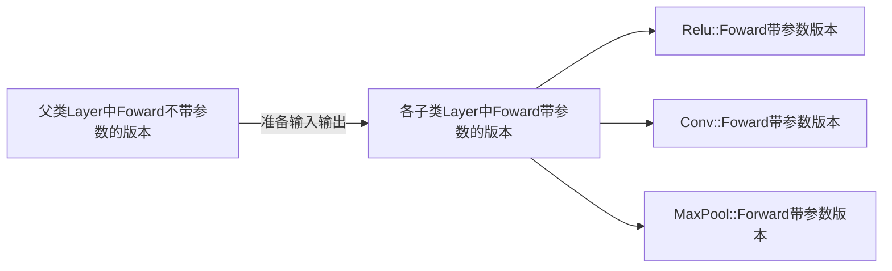

# 自制深度学习推理框架-第五课-KuiperInfer中的算子和注册工厂

> 本课程赞助方：`Datawhale`
>
> 作者：傅莘莘
>
> 主项目：https://github.com/zjhellofss/KuiperInfer 欢迎大家点赞和PR.
>
> 课程代码：https://github.com/zjhellofss/kuiperdatawhale/course5


## 上一节课回忆

在上一节课中我们构建了一个完整的计算图，包括了输入、输出节点以及计算节点等。计算节点在我们这个项目中被称之为`RuntimeOperator`, 具体的结构定义如下的代码所示：

```cpp
struct RuntimeOperator {
  virtual ~RuntimeOperator();

  bool has_forward = false;
  std::string name;      /// 计算节点的名称
  std::string type;      /// 计算节点的类型
  std::shared_ptr<Layer> layer;  /// 节点对应的计算Layer
    
  std::map<std::string, std::shared_ptr<RuntimeOperand>>
      input_operands;  /// 节点的输入操作数
  std::shared_ptr<RuntimeOperand> output_operands;  /// 节点的输出操作数
  std::vector<std::shared_ptr<RuntimeOperand>>
      input_operands_seq;  /// 节点的输入操作数，顺序排列
  std::map<std::string, std::shared_ptr<RuntimeOperator>>
      output_operators;  /// 输出节点的名字和节点对应
  ...
```

在一个计算节点(`RuntimeOperator`)中，我们记录了与该节点相关的类型、名称，以及输入输出数等信息。其中最重要的是`layer`变量，它表示与计算节点关联的算子，也就是进行具体计算的实施者。

通过访问`RuntimeOperator`的输入数(`input_operand`)，`layer`可以获取计算所需的输入张量数据，**并根据`layer`各派生类别中定义的计算函数(`forward`)对输入张量数据进行计算**。计算完成后，计算结果将存储在该节点的输出数(`output_operand`)中。 

## Layer类型的定义

以下的代码位于`include/abstract/layer.hpp`中，**它是所有算子的父类**，如果要实现项目中其他的算子，都需要继承于该类作为派生类并重写其中的计算函数(`forward`)，包括我们这节课要实现的`ReLU`算子。

```cpp
class Layer {
 public:
  explicit Layer(std::string layer_name) : layer_name_(std::move(layer_name)) {}

  virtual ~Layer() = default;

  /**
   * Layer的执行函数
   * @param inputs 层的输入
   * @param outputs 层的输出
   * @return 执行的状态
   */
  virtual InferStatus Forward(
      const std::vector<std::shared_ptr<Tensor<float>>>& inputs,
      std::vector<std::shared_ptr<Tensor<float>>>& outputs);

  /**
   * Layer的执行函数
   * @param current_operator 当前的operator
   * @return 执行的状态
   */
  virtual InferStatus Forward();
  
```

以上的代码定义了`Layer`类的构造函数，它只需要一个`layer_name`变量来指定该算子的名称。我们重点关注带有参数的`Forward`方法，它是算子中定义的计算函数。

这个函数有两个参数，分别是`inputs`和`outputs`。它们是在计算过程中所需的输入和输出张量数组。**每个算子的派生类都需要重写这个带参数的`Forward`方法，并在其中定义计算的具体逻辑。**

```cpp
class Layer {
    ...
    ...
 protected:
  std::weak_ptr<RuntimeOperator> runtime_operator_;
  std::string layer_name_;  /// Layer的名称    
```

我们可以看到，在`Layer`类中有两个成员变量。一个是在构造函数中指定的算子名称 `layer_name`，另一个是与该算子关联的计算节点变量 `RuntimeOperator`。我们在之前回顾了 `RuntimeOperator` 的定义：

```cpp
struct RuntimeOperator {
  ...
  std::shared_ptr<Layer> layer;  /// 节点对应的计算Layer
  ...
```




不难看出，`RuntimeOperator`与该节点对应的 `Layer` 相关联，而 `Layer` 也关联了它所属的 `RuntimeOperator`，因此它们之间是双向关联的关系。

现在我们来看一下 `Layer` 类中不带参数的 `Forward` 方法。这个方法是所有算子的父类方法，**它的作用是准备输入和输出数据，并使用这些数据调用每个派生类算子中各自实现的计算过程**（上文提到的带参数的 `Forward` 函数）。

```cpp
InferStatus Layer::Forward() {
  LOG_IF(FATAL, this->runtime_operator_.expired())
      << "Runtime operator is expired or nullptr";
  // 获取算子相关的计算节点
  const auto& runtime_operator = this->runtime_operator_.lock();
  // 准备节点layer计算所需要的输入
  const std::vector<std::shared_ptr<RuntimeOperand>>& input_operand_datas = runtime_operator->input_operands_seq;
  // layer的输入
  std::vector<std::shared_ptr<Tensor<float>>> layer_input_datas;
  for (const auto& input_operand_data : input_operand_datas) {
    for (const auto& input_data : input_operand_data->datas) {
      layer_input_datas.push_back(input_data);
    }
  }
  ...
  ...
```

在`Layer`类的不带参数的`Forward`方法中，我们首先获取与该`Layer`相对应的计算节点`RuntimeOperator`。它们之间是双向关联的关系，一个算子对应一个计算节点(`RuntimeOperator`），一个计算节点对应一个算子(`Layer`)。

我们从计算节点中得到**该节点对应的输入数**`input_operand_datas`以及**该输入数存储的张量数据**`layer_input_datas`. 随后，我们再从计算节点中取出对应的输出数`output_operand_datas`.

```cpp
  const std::shared_ptr<RuntimeOperand>& output_operand_datas =
      runtime_operator->output_operands;
  InferStatus status = runtime_operator->layer->Forward(
      layer_input_datas, output_operand_datas->datas);
```

在以上的步骤中，我们从计算节点`RuntimeOperator`中获取了相关的输入数和输出数，随后我们再使用对应的输入和输出张量**去调用子类算子各自实现的，带参数的`Forward`函数**。




## 全局的算子注册器

在`KuiperInfer`中算子注册机制使用了单例模式和工厂模式。首先，在全局范围内创建一个唯一的注册表`registry`，它是一个`map`类型的对象。**这个注册表的键是算子的类型，而值是算子的初始化过程。**

开发者完成一个算子的开发后，需要通过特定的注册机制将算子写入全局注册表中。这可以通过在注册表中添加键值对来实现。算子的类型作为键，算子的初始化过程作为值。这样，当需要使用某个算子时，可以根据算子的类型从全局注册表中方便地获取对应的算子。

在实现上单例模式确保了只有一个全局注册表实例，并且可以在代码的任何地方访问该注册表。工厂模式则负责根据算子的类型返回相应的算子实例。这种注册机制的设计使得推理框架能够感知到开发者已经实现的算子，并且能够方便地调用和使用这些算子。

| 算子类型 | 初始化过程   |
| -------- | ------------ |
| Conv     | ConvInstance |
| ReLU     | ReLUInstance |

当所有支持的算子都被添加到注册表中后，我们可以使用`registry.find(layer_type)`来获取特定类型算子的初始化过程，并通过该初始化过程获取相应算子的实例：

```cpp
class LayerRegisterer {
 public:
  typedef ParseParameterAttrStatus (*Creator)
      (const std::shared_ptr<RuntimeOperator> &op, std::shared_ptr<Layer> &layer);
    
  typedef std::map<std::string, Creator> CreateRegistry;
   /**
   * 向注册表注册算子
   * @param layer_type 算子的类型
   * @param creator 需要注册算子的注册表
   */
  static void RegisterCreator(const std::string &layer_type, const Creator &creator);
  ....
 }
```

以上代码中的`creator`是一个函数指针，指向某一类算子的初始化过程，不同的算子具有不同的实例化函数，但是都需要符合要求：

```cpp
  typedef ParseParameterAttrStatus (*Creator)
      (const std::shared_ptr<RuntimeOperator> &op,std::shared_ptr<Layer> &layer);
```

通过以上内容，我们可以观察到**不同的算子实例化函数都需要接受两个参数**：`RuntimeOperator`和待初始化的算子`layer`。这些函数会返回一个`ParseParameterAttrStatus`类型的状态值。

换句话说，这里的`Creator`是一个函数指针类型，用于定义某个类型算子的创建过程。当我们需要使用某个类型的算子时，可以从`CreateRegistry`类型的注册表中获取该算子的创建过程。

然后，我们将相应的`RuntimeOperator`和待初始化的`Layer`传递给创建过程，完成初始化并获得实例化后的算子。

### 注册算子的过程

```cpp
LayerRegisterer::CreateRegistry& LayerRegisterer::Registry() {
  static CreateRegistry* kRegistry = new CreateRegistry();
  CHECK(kRegistry != nullptr) << "Global layer register init failed!";
  return *kRegistry;
}

void LayerRegisterer::RegisterCreator(const std::string &layer_type,
                                      const Creator &creator) {
  CHECK(creator != nullptr);
  CreateRegistry &registry = Registry();
  CHECK_EQ(registry.count(layer_type), 0)
      << "Layer type: " << layer_type << " has already registered!";
  registry.insert({layer_type, creator});
}

LayerRegisterer::CreateRegistry &LayerRegisterer::Registry() {
  static CreateRegistry *kRegistry = new CreateRegistry();
  CHECK(kRegistry != nullptr) << "Global layer register init failed!";
  return *kRegistry;
}
```

首先，让我们来看一下`Registry`函数。这里使用了线程安全的懒汉式代码实现，并且利用了`C++11`标准中的**Magic Static（局部静态变量）**特性。在以上代码中，全局注册表`registry`变量是一个唯一的实例`kRegistry`，无论该函数被调用多少次，都会返回同一个对象。

然后，回到注册函数`RegisterCreator`。这个函数接受两个参数：算子的类型`layer_type`和`Creator`类型。正如前面所述，`creator`参数是该类算子的创建过程，它是一个函数指针。

在`RegistryCreator`函数中，首先获取全局注册表`registry`，然后检查该类型的算子是否已经被注册过。如果没有被注册过，则使用`.insert`将其插入到全局注册表。

### 单元测试

> 我们来实验一下，每次返回的全局注册表是否是唯一的。

```cpp
//
// Created by fss on 23-6-25.
//
#include "layer/abstract/layer_factory.hpp"
#include <gtest/gtest.h>

static LayerRegisterer::CreateRegistry *RegistryGlobal() {
  static LayerRegisterer::CreateRegistry *kRegistry = new LayerRegisterer::CreateRegistry();
  CHECK(kRegistry != nullptr) << "Global layer register init failed!";
  return kRegistry;
}

TEST(test_registry, registry1) {
  using namespace kuiper_infer;
  LayerRegisterer::CreateRegistry *registry1 = RegistryGlobal();
  LayerRegisterer::CreateRegistry *registry2 = RegistryGlobal();
  ASSERT_EQ(registry1, registry2);
}

using namespace kuiper_infer;
ParseParameterAttrStatus MyTestCreator(
    const std::shared_ptr<RuntimeOperator> &op,
    std::shared_ptr<Layer> &layer) {

  layer = std::make_shared<Layer>("test_layer");
  return ParseParameterAttrStatus::kParameterAttrParseSuccess;
}

TEST(test_registry, registry2) {
  using namespace kuiper_infer;
  LayerRegisterer::CreateRegistry registry1 = LayerRegisterer::Registry();
  LayerRegisterer::CreateRegistry registry2 = LayerRegisterer::Registry();
  ASSERT_EQ(registry1, registry2);
  LayerRegisterer::RegisterCreator("test_type", MyTestCreator);
  LayerRegisterer::CreateRegistry registry3 = LayerRegisterer::Registry();
  ASSERT_EQ(registry3.size(), 1);
  ASSERT_NE(registry3.find("test_type"), registry3.end());
}
```

在单元测试`registry1`中，我们两次调用**RegistryGlobal()**来模拟获取全局算子注册器的过程。通过结果我们可以看出，这两次返回的全局注册器指针地址是相同的。

在单元测试`registry2`中，我们使用`RegisterCreator`函数注册了一个与类型名为`test_type`的算子关联的初始化函数。注册完成后，注册器中的元素（即算子初始化函数）的数量等于1.

## 从注册器中取出算子

最后，我们来看一下如何使用注册表中已经注册过的创建过程来实例化一个算子。具体的过程如下所示：

```cpp
std::shared_ptr<Layer> LayerRegisterer::CreateLayer(
    const std::shared_ptr<RuntimeOperator> &op) {
  CreateRegistry &registry = Registry();
  const std::string &layer_type = op->type;
  LOG_IF(FATAL, registry.count(layer_type) <= 0)
      << "Can not find the layer type: " << layer_type;
  const auto &creator = registry.find(layer_type)->second;

  LOG_IF(FATAL, !creator) << "Layer creator is empty!";
  std::shared_ptr<Layer> layer;
  const auto &status = creator(op, layer);
  LOG_IF(FATAL, status != ParseParameterAttrStatus::kParameterAttrParseSuccess)
      << "Create the layer: " << layer_type
      << " failed, error code: " << int(status);
  return layer;
}
```

函数`CreateLayer`用于创建算子，它接受一个名为`RuntimeOperator`的参数作为输入，该参数包含了创建算子所需的所有权重和参数信息。

```cpp
  CreateRegistry &registry = Registry();
  const std::string &layer_type = op->type;
  LOG_IF(FATAL, registry.count(layer_type) <= 0)
      << "Can not find the layer type: " << layer_type;
```

在以上的代码中先获得全局注册表`registry`，再检查这个算子类型`layer_type`是否已经被注册到全局注册表中，如果已经被注册过，则获取到该算子类型对应的创建过程`creator`. 

在前文中，我们说过`creator`是一个算子的创建过程函数，**它的传入参数为包含所有参数和权重等信息的`RuntimeOperator`以及一个待初始化的算子`layer`.** 回到`CreateLayer`函数，当`creator`函数指针被调用之后如果返回状态`status`不为`succcess`, 说明在创建过程中发生了一定的错误，算子初始化失败，需要再排查。

最后，我们再来回顾一下上面的整体过程。首先，我们定义了一个计算过程类型`Creator`和算子类型`Layer`。然后，我们定义了一个在注册表中注册算子的函数`RegisterCreator`。通过该函数，我们可以批量将算子类型和创建过程注册到全局注册表中。当需要使用某个算子时，我们可以根据算子的类型从全局注册表中获取对应的创建过程(即`Creator`类型的函数指针)。

然后，我们将创建时所需的参数和权重打包成`RuntimeOperator`类型，并传递给创建过程，类似于`creator(runtime_operator)`。这样我们就可以获得一个实例化后的算子层，整个过程就如同`CreateLayer`函数中所示。

### 单元测试

```cpp
TEST(test_registry, create_layer) {
  LayerRegisterer::RegisterCreator("test_type_1", MyTestCreator);
  std::shared_ptr<RuntimeOperator> op = std::make_shared<RuntimeOperator>();
  op->type = "test_type_1";
  std::shared_ptr<Layer> layer;
  ASSERT_EQ(layer, nullptr);
  layer = LayerRegisterer::CreateLayer(op);
  ASSERT_NE(layer, nullptr);
}
```

在以上的单元测试中，我们首先注册了一个`layer_type`为`test_type_1`的算子。随后，我们准备了一个空指针`layer`，并将存放了初始化信息所需要的`RuntimeOperator`传入到`CreateLayer`中，完成对该算子的初始化操作。

```cpp
    if (output_data != nullptr && !output_data->empty()) {
      if (input_data->shapes() != output_data->shapes()) {
        LOG(ERROR) << "The input and output tensor shapes of the relu "
                      "layer do not match "
                   << i << " th";
        return InferStatus::kInferFailedInputOutSizeMatchError;
      }
    }
```

## 为了更方便地注册算子

```cpp
class LayerRegistererWrapper {
 public:
  LayerRegistererWrapper(const std::string &layer_type, const LayerRegisterer::Creator &creator) {
    LayerRegisterer::RegisterCreator(layer_type, creator);
  }
};
```

这个工具类只有一个构造函数，该构造函数接受算子的类型和该算子对应的创建过程作为参数。

在`LayerRegistererWrapper`类的构造函数中，我们调用`RegisterCreator`方法来完成对该算子在注册表中的注册。关于`RegisterCreator`的详细讲解，我们已经在前文提及过，不再赘述。 

### 单元测试

```cpp
TEST(test_registry, create_layer_util) {
  LayerRegistererWrapper kDemoInstance("test_type_2", MyTestCreator);
  std::shared_ptr<RuntimeOperator> op = std::make_shared<RuntimeOperator>();
  op->type = "test_type_2";
  std::shared_ptr<Layer> layer;
  ASSERT_EQ(layer, nullptr);
  layer = LayerRegisterer::CreateLayer(op);
  ASSERT_NE(layer, nullptr);
}
```

从上面的代码可以看出，我们使用了工具类`LayerRegistererWrapper`来注册`test_type_2`算子。注册完成后，我们通过调用`CreateLayer`来实例化该算子，并使用`RuntimeOperator`传递相关的类型信息。

通过检查`CreateLayer`的返回结果，我们可以确认`layer`所对应的`test_type_2`算子已成功初始化。换句话说，我们在以上代码中通过使用工具类完成了该算子的注册，并且可以顺利地访问它。

## 创建第一个算子 ReLU


`ReLU`的计算过程非常简单，有如下的定义:$ReLU(x)=max(x,0)$. 

正如前文所述，为了对输入数据进行计算，`ReLU`算子需要实现带参数的前向传播（`Forwards`）过程，实现详见`relu.cpp`.

```cpp
InferStatus ReluLayer::Forward(
    const std::vector<std::shared_ptr<Tensor<float>>>& inputs,
    std::vector<std::shared_ptr<Tensor<float>>>& outputs) {
  if (inputs.empty()) {
    LOG(ERROR) << "The input tensor array in the relu layer is empty";
    return InferStatus::kInferFailedInputEmpty;
  }
  if (inputs.size() != outputs.size()) {
    LOG(ERROR) << "The input and output tensor array size of the relu layer do "
                  "not match";
    return InferStatus::kInferFailedInputOutSizeMatchError;
  }
  ...
```

根据公式$ReLU(x) = max(x,0)$可以看出，`ReLU`算子不会改变输入张量的大小，也就是说输入和输出张量的维度应该是相同的。因此，**上述代码首先检查输入数组是否为空，然后检查输入数组和输出数组中的元素（张量）个数是否相同，如果不满足该条件，程序返回并记录相关错误日志。**

```cpp
  const uint32_t batch_size = inputs.size();
  for (uint32_t i = 0; i < batch_size; ++i) {
	...
    if (output_data != nullptr && !output_data->empty()) {
      if (input_data->shapes() != output_data->shapes()) {
        LOG(ERROR) << "The input and output tensor shapes of the relu "
                      "layer do not match "
                   << i << " th";
        return InferStatus::kInferFailedInputOutSizeMatchError;
      }
    }
  }
```

在以上的代码中，我们对一个批次（batch size）的输入张量数据进行了检查。我们使用`(output_data != nullptr && !output_data->empty())`来检查输出张量是否为空指针，并且检查输出张量是否已经分配空间以存储计算结果。

```cpp
  for (uint32_t j = 0; j < input->size(); ++j) {
      float value = input->index(j);
      output->index(j) = value > 0.f ? value : 0.f;
  }
```

在进行完以上信息检查后，我们使用一个`for`循环逐个处理一个大小为`batch_size`的输入张量数组。很明显，这个内层的`for`循环中，我们逐个读取`input`的值，并判断它与0的大小关系。如果大于0，则保留该值；否则将其置为0.

### ReLU算子的注册

```cpp
ParseParameterAttrStatus ReluLayer::GetInstance(
    const std::shared_ptr<RuntimeOperator> &op,
    std::shared_ptr<Layer> &relu_layer) {
  CHECK(op != nullptr) << "Relu operator is nullptr";
  relu_layer = std::make_shared<ReluLayer>();
  return ParseParameterAttrStatus::kParameterAttrParseSuccess;
}

LayerRegistererWrapper kReluGetInstance("nn.ReLU", ReluLayer::GetInstance);
```

`ReluLayer::GetInstance`是`ReLU`算子的初始化过程，该初始化函数符合之前`Creator`函数指针的参数类型、参数个数和返回值要求。该初始化函数对传入的`layer`进行初始化，并返回表示成功的状态码。

`Creator`函数指针定义如下：

```cpp
  typedef ParseParameterAttrStatus (*Creator)
      (const std::shared_ptr<RuntimeOperator> &op, std::shared_ptr<Layer> &layer);
```

### 单元测试

```cpp
TEST(test_registry, create_layer_reluforward) {
  LayerRegistererWrapper kReluGetInstance("nn.relu", MyTestCreator);
  std::shared_ptr<RuntimeOperator> op = std::make_shared<RuntimeOperator>();
  op->type = "nn.relu";
  std::shared_ptr<Layer> layer;
  ASSERT_EQ(layer, nullptr);
  layer = LayerRegisterer::CreateLayer(op);
  ASSERT_NE(layer, nullptr);

  sftensor input_tensor = std::make_shared<ftensor>(3, 4, 4);
  input_tensor->Rand();
  input_tensor->data() -= 0.5f;
  LOG(INFO) << input_tensor->data();
...

```

在以上的代码中，我们首先创建了一个维度为`3 x 4 x 4`的张量，并以随机方式初始化其数值。因此，该张量中的一部分数值大于0，而另一部分数值小于0.

```cpp
  std::vector<sftensor> inputs(1);
  std::vector<sftensor> outputs(1);
  inputs.at(0) = input_tensor;
  layer->Forward(inputs, outputs);

  for (const auto &output : outputs) {
    output->Show();
  }
```

然后，我们将初始化好的输入张量放入`inputs`数组中。接下来，我们调用`ReLU`算子的`Forward`函数，该函数将计算结果存储在`outputs`张量数组中。

最后，我们将打印输出张量的值，可以观察到`output`张量中的数据等于`input`张量中的数据去掉小于0的部分。

## 课堂作业

实现一个Sigmoid算子并完成注册，同时通过单元测试的结果验证，对应的单元测试文件为`test_sigmoid.cpp` 

* create_layer_find, 这个单元测试评价算子是否注册成功，注册的类型名应该是`nn.Sigmoid`;
* create_layer_sigmoid_forward这个单元测试评价实现的`sigmoid`算子是否运行正确。
