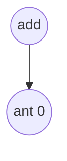
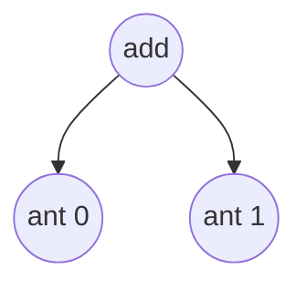
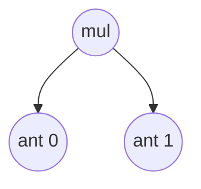
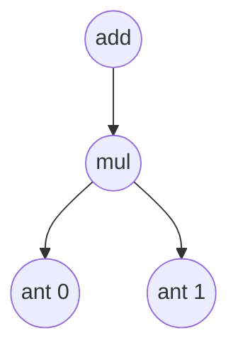
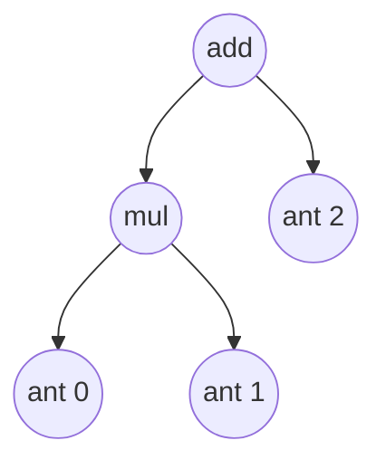

# 自制深度学习推理框架-表达式层的实现

>赞助方： datawhale
>
>作者：[傅莘莘](https://github.com/zjhellofss/KuiperInfer)、[散步](https://github.com/sanbuphy/kineto)、陈前
>
>本章的代码：https://github.com/zjhellofss/kuiperdatawhale.git
>
>补充材料: https://www.bilibili.com/video/BV1HY4y1Z7S3/


## 表达式的定义

`PNNX`中的表达式就是一个二元的计算过程，类似如下：

```
output_mid = input1 + input2;
output = output_mid * input3;
```

在`PNNX`的表达式层（Expression Layer）中，提供了一种计算表达式，该表达式能够在一定程度上折叠计算过程并消除中间变量。例如，在残差结构中的add操作在`PNNX`中就是一个表达式层。

下面是`PNNX`中对上述过程的计算表达式表示，其中的`@0`和`@1`代表之前提到的计算数`RuntimeOperand`，用于表示计算表达式中的输入节点。

```
mul(@2, add(@0, @1));
```

尽管这个抽象表达式看起来比较简单，但实际上可能存在更为复杂的情况，例如以下的例子。因此，在这种情况下，我们需要一个强大而可靠的表达式解析和语法树构建功能。

```
add(add(mul(@0, @1), mul(@2, add(add(add(@0, @2), @3), @4))), @5);
```

## 词法解析

### 词法定义

词法解析的目的是将**add(@0, mul(@1, @2))**拆分为多个Token，拆分后的Token依次为：

1. Identifier: **add**
2. Left bracket: **(**
3. Identifier: **@0**
4. Comma: **,**
5. Identifier: **mul**
6. Left bracket: **(**
7. Identifier: **@1**
8. Comma: **,**
9. Identifier: **@2**
10. Right bracket: **)**

`Token`的类型定义如下：

```
cppCopy Code// 词语的类型
enum class TokenType {
  TokenUnknown = -9,
  TokenInputNumber = -8,
  TokenComma = -7,
  TokenAdd = -6,
  TokenMul = -5,
  TokenLeftBracket = -4,
  TokenRightBracket = -3,
};
```

Token的定义如下，包括以下变量：

1. Token类型，包括add（加法），mul（乘法），bracket（左右括号）等；
2. Token在原句子中的开始和结束位置，即`start_pos`和`end_pos`；

对于表达式**add(@0, mul(@1, @2))**，我们可以将它切分为多个Token，其中Token(add)的`start_pos`为0，`end_pos`为3。

```cpp
// 词语Token
struct Token {
    TokenType token_type = TokenType::TokenUnknown;
    int32_t start_pos = 0; // 词语开始的位置
    int32_t end_pos = 0;   // 词语结束的位置
    Token(TokenType token_type, int32_t start_pos, int32_t end_pos)
        : token_type(token_type), start_pos(start_pos), end_pos(end_pos) {

        }
};
```

最后，在词法解析结束后，我们需要将这些 Token（词语）按照它们的出现顺序和层级关系组成一棵语法树。

```cpp
// 语法树的节点
struct TokenNode {
    int32_t num_index = -1;
    std::shared_ptr<TokenNode> left = nullptr;   // 语法树的左节点
    std::shared_ptr<TokenNode> right = nullptr;  // 语法树的右节点
    TokenNode(int32_t num_index, std::shared_ptr<TokenNode> left,
              std::shared_ptr<TokenNode> right);
    TokenNode() = default;
};
```

### 词法解析

#### 判断句子是否为空

```cpp
CHECK(!statement_.empty()) << "The input statement is empty!";
```

#### 移除句子中的空格

```cpp
statement_.erase(std::remove_if(statement_.begin(), statement_.end(),
                                [](char c) { return std::isspace(c); }),
                 statement_.end());
CHECK(!statement_.empty()) << "The input statement is empty!";
```

如果表达式层中有表达式为`add(@0,   @1)`，我们删除其中的空格后就会得到新的表达式`add(@0,@1)`。

#### 逐个解析句子的字符

```cpp
for (int32_t i = 0; i < statement_.size();) {
    char c = statement_.at(i);
    if (c == 'a') {
        CHECK(i + 1 < statement_.size() && statement_.at(i + 1) == 'd')
            << "Parse add token failed, illegal character: "
            << statement_.at(i + 1);
        CHECK(i + 2 < statement_.size() && statement_.at(i + 2) == 'd')
            << "Parse add token failed, illegal character: "
            << statement_.at(i + 2);
        Token token(TokenType::TokenAdd, i, i + 3);
        tokens_.push_back(token);
        std::string token_operation =
            std::string(statement_.begin() + i, statement_.begin() + i + 3);
        token_strs_.push_back(token_operation);
        i = i + 3;
    } 
```

假设字符 `c` 表示当前的字符。如果 `c` 等于字符 'a'，根据我们的词法规定，Token 中以 'a' 开头的情况只有 add。因此，我们需要判断接下来的两个字符是否分别是 'd' 和 'd'。如果不是，则报错。如果是的话，则初始化一个新的 Token，并保存其初始和结束位置。

举个例子，如果表达式中的单词以 'a' 开头，那么它只能是 add，而不能是其他词汇表之外的单词，例如 `axc` 等情况。

```cpp
CHECK(i + 1 < statement_.size() && statement_.at(i + 1) == 'd')
    << "Parse add token failed, illegal character: "
    << statement_.at(i + 1);
CHECK(i + 2 < statement_.size() && statement_.at(i + 2) == 'd')
    << "Parse add token failed, illegal character: "
    << statement_.at(i + 2);
Token token(TokenType::TokenAdd, i, i + 3);
tokens_.push_back(token);
std::string token_operation =
    std::string(statement_.begin() + i, statement_.begin() + i + 3);
token_strs_.push_back(token_operation);
```

如果在第一行中，我们判断第二个字符是否为 'd'；若是，在第二行中，我们判断第三个字符是否也是 'd'。如果满足条件，我们将初始化一个 Token 实例，并保存该单词在句子中的起始位置和结束位置。

同样地，如果某个字符 `c` 是 'm'，我们需要判断接下来的字符是否是 'u' 和 'l'。如果不满足条件，则说明我们的表达式中出现了词汇表之外的单词（因为词汇表只允许以 'm' 开头的单词是 "mul"）。如果满足条件，我们同样会初始化一个 Token 实例，并保存该单词的起始和结束位置，以及 Token 的类型。

```cpp
else if (c == '@') {
    CHECK(i + 1 < statement_.size() && std::isdigit(statement_.at(i + 1)))
        << "Parse number token failed, illegal character: " << c;
    int32_t j = i + 1;
    for (; j < statement_.size(); ++j) {
        if (!std::isdigit(statement_.at(j))) {
            break;
        }
    }
    Token token(TokenType::TokenInputNumber, i, j);
    CHECK(token.start_pos < token.end_pos);
    tokens_.push_back(token);
    std::string token_input_number = std::string(statement_.begin() + i, statement_.begin() + j);
    token_strs_.push_back(token_input_number);
    i = j;
```

如果第一个字符是 '@'，我们需要读取 '@' 后面的所有数字。如果紧跟在 '@' 后面的字符不是数字，则报错。如果是数字，则将这些数字全部读取并组成一个单词（Token）。

最后，在正确解析和创建这些 Token 后，我们将它们放入名为 `tokens` 的数组中，以便进行后续处理。

```cpp
tokens_.push_back(token);
```

## 语法解析

### 语法树的定义

```cpp
struct TokenNode {
    int32_t num_index = -1;
    std::shared_ptr<TokenNode> left = nullptr;
    std::shared_ptr<TokenNode> right = nullptr;
    TokenNode(int32_t num_index, std::shared_ptr<TokenNode> left, std::shared_ptr<TokenNode> right);
    TokenNode() = default;
};
```

在进行语法分析时，我们可以根据词法分析得到的 `token` 数组构建抽象语法树。抽象语法树是一个由二叉树组成的结构，每个节点都存储了操作或值，并通过左子节点和右子节点与其他节点连接。

对于表达式 "add (@0, @1)"，当 `num_index` 等于 1 时，表示计算数为 @0；当 `num_index` 等于 2 时，表示计算数为 @1。若 `num_index` 为负数，则说明当前节点是一个计算节点，如 "mul" 或 "add" 等。

以下是一个简单的示例：

```
     add
    /   \
  @0     @1
```

在这个示例中，根节点是 "add"，左子节点是 "@0"，右子节点是 "@1"。这个抽象语法树表示了一个将 "@0" 和 "@1" 进行相加的表达式。

通过将词法分析得到的 `token` 数组解析并构建抽象语法树，我们可以进一步对表达式进行语义分析和求值等操作。

### 递归向下的解析

语法解析的过程是递归向下的,定义在`Generate_`函数中。

```cpp
std::shared_ptr<TokenNode> ExpressionParser::Generate_(int32_t &index) {
    CHECK(index < this->tokens_.size());
    const auto current_token = this->tokens_.at(index);
    CHECK(current_token.token_type == TokenType::TokenInputNumber
          || current_token.token_type == TokenType::TokenAdd || current_token.token_type == TokenType::TokenMul);
```

这个函数处理的对象是词法解析的Token（单词）数组，因为`Generate_`是一个递归函数，所以`index`参数指向Token数组中的当前处理位置.

`current_token`表示当前被处理的Token，它作为**当前递归层**的第一个Token，必须是以下类型之一。

```cpp
TokenInputNumber = 0,
TokenAdd = 2,
TokenMul = 3,
```

**如果当前Token的类型是输入数字类型，那么会直接返回一个操作数Token作为叶子节点，不再进行下一层递归。**例如，在表达式add(@0, @1)中的@0和@1被归类为输入数字类型的Token，在解析到这两个Token时，会直接创建并返回语法树节点`TokenNode`。

```cpp
if (current_token.token_type == TokenType::TokenInputNumber) {
    uint32_t start_pos = current_token.start_pos + 1;
    uint32_t end_pos = current_token.end_pos;
    CHECK(end_pos > start_pos);
    CHECK(end_pos <= this->statement_.length());
    const std::string &str_number =
        std::string(this->statement_.begin() + start_pos, this->statement_.begin() + end_pos);
    return std::make_shared<TokenNode>(std::stoi(str_number), nullptr, nullptr);

}
```

**如果当前Token的类型是mul或者add，我们需要进行下一层递归来构建对应的左子节点和右子节点。**

例如，在处理add(@1,@2)时，遇到add token之后，我们需要做以下的两步：

1. 首先判断是否存在左括号（left bracket）
2. 然后继续向下递归以获取@1，但由于@1代表的是数字类型，递归后立即返回，如以上代码块中第一行对数字类型Token的处理。

```cpp
else if (current_token.token_type == TokenType::TokenMul || current_token.token_type == TokenType::TokenAdd) {
    std::shared_ptr<TokenNode> current_node = std::make_shared<TokenNode>();
    current_node->num_index = -int(current_token.token_type);

    index += 1;
    CHECK(index < this->tokens_.size());
    // 判断add之后是否有( left bracket
    CHECK(this->tokens_.at(index).token_type == TokenType::TokenLeftBracket);

    index += 1;
    CHECK(index < this->tokens_.size());
    const auto left_token = this->tokens_.at(index);
    // 判断当前需要处理的left token是不是合法类型
    if (left_token.token_type == TokenType::TokenInputNumber
        || left_token.token_type == TokenType::TokenAdd || left_token.token_type == TokenType::TokenMul) {
        // (之后进行向下递归得到@0
        current_node->left = Generate_(index);
    } else {
        LOG(FATAL) << "Unknown token type: " << int(left_token.token_type);
    }
}
```

在第17行当左子树递归构建完毕后，对于表达式`add(@0, @1)`，我们将左子树连接到`current_node`的`left`指针中，随后我们开始构建右子树。



```cpp
	index += 1; 
    // 当前的index指向add(@1,@2)中的逗号
    CHECK(index < this->tokens_.size());
    // 判断是否是逗号
    CHECK(this->tokens_.at(index).token_type == TokenType::TokenComma);

    index += 1;
    CHECK(index < this->tokens_.size());
    // current_node->right = Generate_(index);构建右子树
    const auto right_token = this->tokens_.at(index);
    if (right_token.token_type == TokenType::TokenInputNumber
        || right_token.token_type == TokenType::TokenAdd || right_token.token_type == TokenType::TokenMul) {
      current_node->right = Generate_(index);
    } else {
      LOG(FATAL) << "Unknown token type: " << int(left_token.token_type);
    }

    index += 1;
    CHECK(index < this->tokens_.size());
    CHECK(this->tokens_.at(index).token_type == TokenType::TokenRightBracket);
    return current_node;
```

随后我们需要判断@0之后是否存在comma token，如上代码中的第五行。在构建右子树的过程中，对于表达式`add(@1,@2)`，当`index`指向逗号的位置时，首先需要判断是否存在逗号。接下来，我们开始构建右子树，在右子树的向下递归分析中，会得到`@2`作为一个叶子节点。

当右子树构建完成后，将该节点（即`Generate_`返回的`TokenNode`，此处为一个叶子节点，其数据为`@1`）放置于`current_node`的`right`指针中。




### 一个例子

我们以一个简单点的例子为开始，假设现在表达式层中的表达式是：`add(@0,@1)`。在词法解析模块中，这个表达式将被构建成一个单词(Token)数组，如以下：

- add
- (
- @0
- ,
- @1
- )

在词法解析结束之后，这个表达式将被传递到语法解析模块中，用于构建抽象语法树。`Generate_`函数首先检查Token数组中的当前单词(Token)是否是以下类型的一种：

```cpp
  CHECK(index < this->tokens_.size());
  const auto current_token = this->tokens_.at(index);
  CHECK(current_token.token_type == TokenType::TokenInputNumber ||
        current_token.token_type == TokenType::TokenAdd ||
        current_token.token_type == TokenType::TokenMul);
```

当前的索引为0，表示正在处理Token数组中的"add"单词。**针对这个输入，我们需要判断其后是否是"左括号"来确定其合法性。**如果是合法的（add单词之后存在括号），我们将构建一个左子树。因为对于一个add调用，它的后面总是跟着一个左括号"("。

```cpp
else if (current_token.token_type == TokenType::TokenMul ||
         current_token.token_type == TokenType::TokenAdd) {
    std::shared_ptr<TokenNode> current_node = std::make_shared<TokenNode>();
    current_node->num_index = int(current_token.token_type);

    index += 1;
    CHECK(index < this->tokens_.size()) << "Missing left bracket!";
    CHECK(this->tokens_.at(index).token_type == TokenType::TokenLeftBracket);

    index += 1;
    CHECK(index < this->tokens_.size()) << "Missing correspond left token!";
    const auto left_token = this->tokens_.at(index);
```

在以上代码的第8行中，我们对'add'之后的一个Token进行判断，如果是左括号则匹配成功，开始匹配括号内的元素。对于输入`add(@0, @1)`，在第10行中，当对索引进行+1操作后，我们得到了括号内部的元素`left_token`.

随后我们开始递归构建表达式的左子树：

```cpp
if (left_token.token_type == TokenType::TokenInputNumber ||
    left_token.token_type == TokenType::TokenAdd ||
    left_token.token_type == TokenType::TokenMul) {
    current_node->left = Generate_(index);
} 
```

对于当前的例子，当前索引(index)指向的单词是@0。因此，我们需要对@0之后的元素进行构建左子树的操作。在这种情况下，由于索引指向的位置是一个输入数字(`TokenType::TokenInputNumber`)的类型，所以该节点进入递归调用后将直接返回。

根据前文给出的例子，'add'的左子树构建完毕后，**下一步我们需要判断中add(@0,@1)的@0之后是否存在逗号。**


```cpp
index += 1;
CHECK(index < this->tokens_.size()) << "Missing comma!";
CHECK(this->tokens_.at(index).token_type == TokenType::TokenComma);
```

接下来，我们要为如上的二叉树构建右子树：

```cpp
const auto right_token = this->tokens_.at(index);
if (right_token.token_type == TokenType::TokenInputNumber ||
    right_token.token_type == TokenType::TokenAdd ||
    right_token.token_type == TokenType::TokenMul) {
    current_node->right = Generate_(index);
} else {
    LOG(FATAL) << "Unknown token type: " << int(right_token.token_type);
}
```

同样，由于当前索引(index)指向的位置是@1，它是一个输入数据类型，所以该节点在进入递归调用后将直接返回，并成为add节点的右子树。


```cpp
std::shared_ptr<TokenNode> ExpressionParser::Generate_(int32_t &index) {
    CHECK(index < this->tokens_.size());
    ...
    ...
    如果是Input Number就直接返回

    if (current_token.token_type == TokenType::TokenInputNumber) {
        uint32_t start_pos = current_token.start_pos + 1;
        uint32_t end_pos = current_token.end_pos;
        CHECK(end_pos > start_pos);
        CHECK(end_pos <= this->statement_.length());
        const std::string &str_number =
            std::string(this->statement_.begin() + start_pos, this->statement_.begin() + end_pos);
        return std::make_shared<TokenNode>(std::stoi(str_number), nullptr, nullptr);

    }
}
```

### 一个更复杂些的例子

如果现在有一个表达式`add(mul(@0,@1),@2)`，那么我们应该如何对其进行语法解析呢？在词法解析中，它将被分割成以下的数个单词组成的数组：

1. add
2. left bracket
3. mul 
4. left bracket
5. @0 
6. comma
7. @1
8. right bracket
9. comma
10. @2
11. right bracket

当以上的数组被输入到语法解析中后，index的值等于0. 随后我们再判断index指向位置的单词类型是否符合要求。

```cpp
CHECK(current_token.token_type == TokenType::TokenInputNumber ||
      current_token.token_type == TokenType::TokenAdd ||
      current_token.token_type == TokenType::TokenMul);
```

如果该表达式的第一个单词是"add"，那么我们就像之前的例子一样，将它作为二叉树的左子树进行构建。

```cpp
if (left_token.token_type == TokenType::TokenInputNumber ||
    left_token.token_type == TokenType::TokenAdd ||
    left_token.token_type == TokenType::TokenMul) {
    current_node->left = Generate_(index);
```

已知表达式为`add(mul(@0,@1),@2)`，在处理完这个表达式的左括号之后，**当前指向的标记是"mul"，它不属于输入参数类型。因此，在调用`Generate_`函数时，我们将对"mul"子表达式进行递归分析。** "mul"子表达式的分析结果如下图所示：



在子表达式的解析完成并返回后，我们将这颗子树插入到当前节点的左指针上**(current_node->left = Generate_(index))**




**随后我们开始解析`add(mul(@0,@1),@2)`表达式中@2以及其之后的部分作为add的右子树。**

```cpp
if (right_token.token_type == TokenType::TokenInputNumber ||
    right_token.token_type == TokenType::TokenAdd ||
    right_token.token_type == TokenType::TokenMul) {
    current_node->right = Generate_(index);
} else {
    LOG(FATAL) << "Unknown token type: " << int(right_token.token_type);
}
```

在第4行调用`Generate_`之后，由于@2是一个输入数类型，不能再进行递归分析，所以它将被直接返回并赋值给`current_node->right`。



```cpp
std::shared_ptr<TokenNode> ExpressionParser::Generate_(int32_t &index) {
    CHECK(index < this->tokens_.size());
    ...
    ...
    如果是Input Number就直接返回

    if (current_token.token_type == TokenType::TokenInputNumber) {
        uint32_t start_pos = current_token.start_pos + 1;
        uint32_t end_pos = current_token.end_pos;
        CHECK(end_pos > start_pos);
        CHECK(end_pos <= this->statement_.length());
        const std::string &str_number =
            std::string(this->statement_.begin() + start_pos, this->statement_.begin() + end_pos);
        return std::make_shared<TokenNode>(std::stoi(str_number), nullptr, nullptr);

    }
}
```

最终，我们成功完成了这个较为复杂的二叉树构建例子。

## 单元测试


## 对语法树的中序遍历


## 单元测试


## 表达式层的实现


## 单元测试


## 本节课的作业

